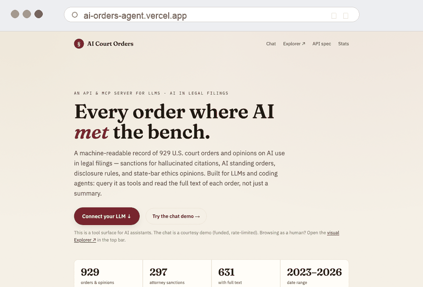

# ai-orders-agent



Agent-facing service for the **AI Court Orders** dataset — one Vercel project that
exposes the same queries four ways:

- **Chat** (`/chat`) — a hosted chat UI; ask in plain English, no setup. A funded,
  rate-limited LLM (OpenRouter DeepSeek by default) answers by calling the dataset
  tools (see [Chat](#chat) below).
- **MCP** (`/api/mcp`) — add as a custom connector in Claude Desktop / claude.ai, or any MCP client.
- **OpenAPI** (`/openapi.json`) — import into a ChatGPT GPT (Actions) or any function-calling LLM.
- **REST/JSON** (`/api/*`) — call directly from code or the browser.

It is **read-only** and **stateless**: it live-fetches the dataset the
[AI-orders-explorer](https://github.com/legalrealist/AI-orders-explorer) repo
publishes (that repo owns the data pipeline, the human web explorer, and the
Claude-Code skill — this one is purely the agent surface) and caches it in memory.

## Data source

Set `ORDERS_DATA_BASE` to where the dataset (`explorer_data.json` and
`bar_opinions.json`) is published. Defaults to the live published copy at
`https://legalhack.io/data` (943 records). See `.env.example`.

## Endpoints

| | |
|---|---|
| `GET /api/search?q=&<filters>&limit=&full=&count=` | full-text search + filters |
| `GET /api/list?<filters>` | filter without a text query |
| `GET /api/record/{id}` · `GET /api/pdf/{id}` | one record · its PDF/links |
| `GET /api/facets?field=&limit=&all=&<filters>` | distinct values + counts (honors all search/list filters) |
| `GET /api/stats` · `GET /api/bar?state=` | summary · state-bar opinions |
| `GET /api/mcp` · `GET /openapi.json` | MCP endpoint · OpenAPI spec |
| `GET /chat` · `POST /api/chat` | hosted chat UI · streaming chat backend |

**Filters** (search/list/facets): `judge` (title-insensitive), `court` (alias-aware: `sdny`/`S.D.N.Y.`/full name),
`state`, `type`, `consequence`, `ai_type`, `applies_to` (multi-value), `source`, `jurisdiction`,
`tag`, `requires`, `date_from`, `date_to`, `has_pdf`, `has_link`.

`requires=<key>` matches records whose `reqs[key]` is set — `disclose` (~128), `certify_if_ai` (~106),
`verify`, `prohibited`, `certify_all`, `proprietary` — answering "which courts require AI disclosure / a
certification?". Because `facets` honors every filter, `facets?field=court&consequence=sanctions_attorney`
ranks courts by attorney-sanction count and `facets?field=court&requires=disclose` ranks them by disclosure
requirements. The compact projection includes `summary`.

## Chat

`/chat` is a streaming chat UI. The backend (`POST /api/chat`) runs a bounded
tool-calling loop: an LLM answers questions by calling the same dataset
operations the MCP/REST surfaces use (tool definitions are shared via
`lib/tools.ts`, so the surfaces never drift). It is **read-only** — the tools only
search and read the public dataset.

**Provider.** Default is OpenRouter (`CHAT_PROVIDER=openrouter`) on a cheap
DeepSeek model. Set `CHAT_PROVIDER=anthropic` or `openai` to switch; each reads
its own server-only key. Keys never reach the browser.

**Rate limiting.** The funded path is protected by three independent limits —
per-IP burst, per-IP daily cap, and a global daily kill-switch — backed by
[Upstash Redis](https://upstash.com/). Set `UPSTASH_REDIS_REST_URL` and
`UPSTASH_REDIS_REST_TOKEN` for the public deploy. **Without Upstash, limiting
falls back to a best-effort in-memory limiter** that is not durable across Vercel
invocations — fine for local dev, not safe for a public funded endpoint.

See `.env.example` for all chat/rate-limit variables.

## Run / deploy

```bash
npm install
npm run dev        # http://localhost:3000  (try /chat, /api/stats, /openapi.json, /api/mcp)
npm test           # query-logic parity tests
vercel deploy      # or push to a Vercel-connected GitHub repo
```

### Connect it

- **Claude** (Desktop or claude.ai): add a custom connector pointing at `https://<your-deploy>/api/mcp`.
- **ChatGPT**: create a GPT → Actions → import `https://<your-deploy>/openapi.json`.
- **Other LLMs / code**: call the REST endpoints, or use the OpenAPI spec for function-calling.

Query behavior (court aliasing, title-insensitive judge match, multi-value
`applies_to`, facet placeholder handling) mirrors the explorer's `orders` CLI.

## License

MIT — see [LICENSE](LICENSE).
