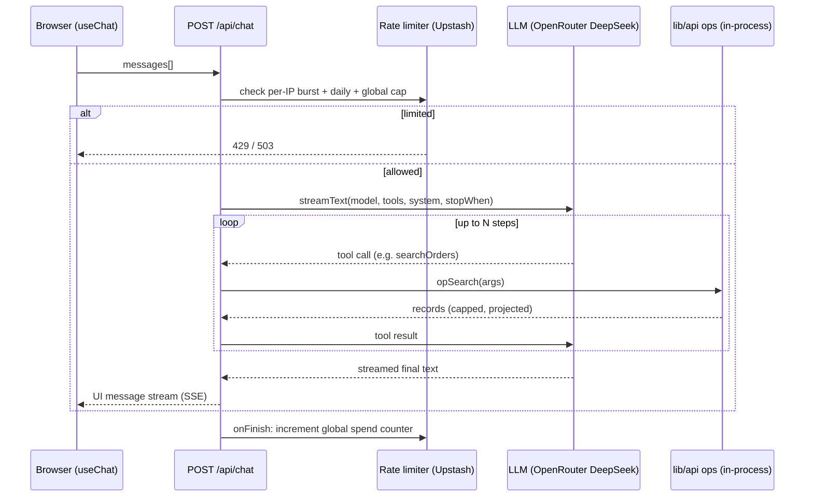

# feat: Chat webapp over the AI Court Orders agent surface

## Summary

Add a public, browser-based chat to the existing `ai-orders-agent` Next.js app. A user types a question; a server-side LLM (default: a funded, rate-limited OpenRouter **DeepSeek** model) answers by calling the dataset's existing in-process operations (`opSearch`, `opGet`, `opFacets`, `opStats`, `opPdf`, `opBar`) as tools, and streams the answer back. The same page surfaces the already-live **MCP** (`/api/mcp`) and **OpenAPI** (`/openapi.json`) endpoints so users can connect Claude and ChatGPT to the identical agent surface.

The funded path is the first thing in this repo that spends money on each request, so a durable rate-limit / cost-cap layer is part of the core scope, not an afterthought.

---

## Problem Frame

The agent surface today is reachable only by people who already run an MCP client or a function-calling LLM. There is no zero-setup way for a casual visitor to ask the dataset a natural-language question. This plan adds that front door — a hosted chat — while keeping the connect-your-own-assistant paths (Claude via MCP, ChatGPT via OpenAPI Actions) prominent.

**Constraints carried from the existing codebase** (see repo research):
- Next.js 15 App Router, React 19, TypeScript strict, zod 3, deployed on Vercel. No DB — data is live-fetched and cached in memory (`lib/data.ts`).
- Thin route handlers delegate to shared in-process ops in `lib/api.ts`; the MCP route (`app/api/[transport]/route.ts`) already defines zod tool schemas for every op. The chat tools must reuse those, not re-describe them.
- No styling system, no middleware, no auth, no rate limiting exist yet. CORS is wide open. The chat endpoint is the first that must be protected.
- Path alias `@/*` → repo root. Env vars read directly from `process.env` with fallbacks; secrets must stay server-only (no `NEXT_PUBLIC_`).

---

## Scope Boundaries

**In scope**
- A `/chat` page with a streaming chat UI.
- A server `POST /api/chat` route running a bounded tool-calling loop over the existing dataset ops, defaulting to OpenRouter DeepSeek.
- Durable rate limiting + a global cost kill-switch protecting the funded key.
- A "Connect your own assistant" section packaging the existing MCP and OpenAPI endpoints (Claude / ChatGPT).
- Provider abstraction so Anthropic and OpenAI can be selected server-side via env, sharing one set of tool definitions.

**Out of scope (non-goals)**
- User accounts, chat history persistence, or multi-turn storage beyond the in-browser session.
- A user-facing "paste your own API key" UI. The funded OpenRouter DeepSeek key is the only public provider; Anthropic/OpenAI are server-configured alternatives, not BYO-key surfaces.
- Changes to the dataset, the data pipeline, or the existing REST/OpenAPI/MCP query behavior.
- A design system overhaul — the chat UI uses minimal styling consistent with the current bare app.

### Deferred to Follow-Up Work
- Per-user authentication / allowlisting (current decision is public + rate-limited).
- Streaming generative tool-result UI (rich cards per record) beyond simple tool-call status + text.
- Capturing learnings via `/ce-compound` once the AI SDK version, model choice, and rate-limit approach are proven in production.

---

## Key Technical Decisions

**KTD-1 — Use the Vercel AI SDK (`ai` v5) for the chat loop.** It gives one `streamText` tool-calling loop, zod-defined tools portable across OpenRouter/Anthropic/OpenAI by swapping only the `model:` value, and a `useChat` React hook for streaming. v5 (not v6) is the safe default; the streaming/tool/`useChat` APIs are identical across v5/v6, and the v5→v6 breaks (object generation, async `convertToModelMessages`) are off this critical path. *(see research: AI SDK 4→5 migration notes — `maxSteps`→`stopWhen: stepCountIs`, `parameters`→`inputSchema`, `toDataStreamResponse`→`toUIMessageStreamResponse`.)*

**KTD-2 — Tools call the in-process ops directly; no HTTP/MCP loopback.** `opSearch` et al. are plain functions; the chat tool `execute` calls them in-process. An HTTP round-trip back to `/api/search` would be slower and add a failure mode for nothing.

**KTD-3 — Single source of truth for tool/filter schemas.** Factor the zod `FILTERS` shape and the per-tool description/op binding out of `app/api/[transport]/route.ts` into `lib/`, so both the MCP route and the chat route import them. Prevents the two agent surfaces from drifting.

**KTD-4 — Bound cost per request with `stopWhen: stepCountIs(N)` + `maxOutputTokens`.** This one knob is both the correctness control (lets the model finish its answer after tool calls) and the primary per-request cost/timeout guard. Pair with `export const maxDuration` and `runtime = 'nodejs'` (tools do `fetch`; edge adds constraints for no benefit).

**KTD-5 — Durable rate limiting via Upstash Redis, with an in-memory soft fallback.** Vercel serverless has no shared memory across invocations, so an in-memory counter is not a real limit for a funded key. Use `@upstash/ratelimit` for: per-IP token bucket (burst), per-IP fixed-window daily cap (cost ceiling), and a single global daily request/spend counter as a kill-switch (returns 503 when tripped). When Upstash env vars are absent (local dev), fall back to a best-effort in-memory limiter so the app still runs — but log that protection is degraded. *(see research: durable state is required on Vercel; layer independent limits.)*

**KTD-6 — Treat tool output as untrusted; least-privilege tools only.** All tools are read-only over a public dataset. Validate every tool input with strict zod (bounded `limit`, capped string lengths), cap the number of records returned to the model, and frame tool output in the system prompt as data, not instructions. A successful prompt injection can then do nothing worse than produce a weird answer over public data.

**KTD-7 — Provider selection is server-side env config.** A `CHAT_PROVIDER` env (default `openrouter`) plus per-provider model envs choose the model; the tool set and route logic are provider-agnostic. Anthropic/OpenAI keys, if set, stay server-only.

---

## High-Level Technical Design

Request flow for one chat turn:



Provider portability (KTD-1/-7): the `tools` object and route are defined once; `model:` is resolved from env at request time to OpenRouter / Anthropic / OpenAI.

---

## Output Structure

New and changed files (repo-relative):

```
lib/
  tools.ts          # NEW — shared FILTERS zod shape + tool metadata/op bindings (U1)
  llm.ts            # NEW — server-only provider resolver (OpenRouter/Anthropic/OpenAI) (U2)
  ratelimit.ts      # NEW — Upstash limiters + in-memory fallback + global kill-switch (U3)
  ratelimit.test.ts # NEW — pure-logic tests for limiter decisions (U3)
  tools.test.ts     # NEW — tool/op binding + schema parity test (U1)
app/
  api/
    chat/route.ts   # NEW — streaming tool-calling chat endpoint (U4)
    [transport]/route.ts  # MODIFIED — import shared schemas from lib/tools.ts (U1)
  chat/
    page.tsx        # NEW — chat page (server shell) (U5)
    Chat.tsx        # NEW — 'use client' useChat component (U5)
  page.tsx          # MODIFIED — link to /chat + Connect section (U6)
.env.example        # MODIFIED — OPENROUTER_API_KEY, UPSTASH_*, provider envs (U7)
README.md           # MODIFIED — chat + env docs (U7)
```

---

## Implementation Units

### U1. Extract shared tool/filter schemas into `lib/tools.ts`

**Goal:** One source of truth for the dataset's tool definitions, imported by both the MCP route and the new chat route.

**Requirements:** Supports KTD-3. Precondition for U4.

**Dependencies:** none.

**Files:** `lib/tools.ts` (new), `lib/tools.test.ts` (new), `app/api/[transport]/route.ts` (modify).

**Approach:** Move the zod `FILTERS` shape and the per-tool spec (name, description, input schema, and a reference to its `op*` implementation in `lib/api.ts`) out of the MCP route into `lib/tools.ts` as a plain data structure consumable by both wrappers. Each tool entry exposes: `name`, `description`, the zod input schema (raw shape for mcp-handler, `z.object(...)` for the AI SDK), and an `execute(args)` that calls the matching `lib/api.ts` op and returns a size-capped result. Rewrite `app/api/[transport]/route.ts` to build its `server.tool(...)` registrations from this shared structure — behavior must be byte-identical to today.

**Patterns to follow:** the existing zod `FILTERS` block and tool registrations in `app/api/[transport]/route.ts`; op signatures in `lib/api.ts`; `@/` import alias.

**Test scenarios** (`lib/tools.test.ts`):
- Every op in `lib/api.ts` (`search`, `list`, `get`, `pdf`, `facets`, `stats`, `bar`) has exactly one corresponding tool entry, and every tool entry's `name`/description is non-empty.
- Each tool's input schema parses a representative valid args object and rejects an out-of-range one (e.g. `limit` above the cap, unknown enum) — proving the bounded-input contract of KTD-6.
- A tool `execute` over a small in-memory fixture returns the same projected shape the equivalent `op*` returns, and caps the record count at the configured maximum.

**Verification:** `npm test` green; MCP route still compiles and registers the same seven tools (manual check of `/api/mcp` tool list unchanged).

---

### U2. Server-only LLM provider resolver `lib/llm.ts`

**Goal:** Resolve the active model from env, keeping every provider key server-side.

**Requirements:** Supports KTD-1, KTD-7.

**Dependencies:** none (parallel to U1).

**Files:** `lib/llm.ts` (new).

**Approach:** Add `import 'server-only'` at the top. Read `CHAT_PROVIDER` (default `openrouter`). Export a `getModel()` that returns the AI SDK model instance: OpenRouter via `@openrouter/ai-sdk-provider` using `OPENROUTER_API_KEY` and `OPENROUTER_MODEL` (default a DeepSeek model id); Anthropic via `@ai-sdk/anthropic` (`ANTHROPIC_API_KEY`/`ANTHROPIC_MODEL`); OpenAI via `@ai-sdk/openai` (`OPENAI_API_KEY`/`OPENAI_MODEL`). Throw a clear error if the selected provider's key is missing. Mirror the `process.env.X || default` pattern from `lib/data.ts`.

**Patterns to follow:** env-read pattern in `lib/data.ts`; never use `NEXT_PUBLIC_`.

**Test scenarios:** `Test expectation: none -- thin env-config + provider-factory wiring; behavior is exercised through U4's route. Add a unit test only if a model-id mapping function grows non-trivial.`

**Verification:** importing `lib/llm.ts` from a client component fails the build (proves server-only); `getModel()` returns a usable model with `OPENROUTER_API_KEY` set.

---

### U3. Rate-limit + cost-cap layer `lib/ratelimit.ts`

**Goal:** Protect the funded key with durable per-IP and global limits, degrading gracefully when Upstash is unconfigured.

**Requirements:** Supports KTD-5. Precondition for U4.

**Dependencies:** none (parallel to U1/U2).

**Files:** `lib/ratelimit.ts` (new), `lib/ratelimit.test.ts` (new).

**Approach:** Using `@upstash/ratelimit` + `@upstash/redis`, expose an async `checkLimits(ip, sessionId)` that runs three independent checks — per-IP token bucket (burst), per-IP fixed-window daily cap, and a global daily request counter (kill-switch) — and returns a structured decision `{ ok, status, retryAfter, reason }` (429 for per-IP, 503 for global). Keep the limit thresholds in named constants. When `UPSTASH_REDIS_REST_URL`/`TOKEN` are absent, construct an in-memory best-effort limiter and return decisions from it, plus a `degraded: true` flag so the route can log a warning. Keep the pure decision logic (given counts → decision) in a small exported function so it is unit-testable without Redis.

**Patterns to follow:** env-read pattern in `lib/data.ts`; `{ error }`/status response convention in `lib/http.ts`.

**Test scenarios** (`lib/ratelimit.test.ts`, against the pure decision function):
- Under all thresholds → `{ ok: true }`.
- Burst count exceeds the per-IP token bucket → `{ ok: false, status: 429, retryAfter > 0 }`.
- Per-IP daily count at the cap → `{ ok: false, status: 429 }`.
- Global counter at the kill-switch threshold → `{ ok: false, status: 503 }` (global cap takes precedence / distinct reason from per-IP).
- Missing/garbage IP falls back to a default bucket rather than throwing.

**Verification:** `npm test` green; with no Upstash env, the module loads and returns `degraded: true` decisions instead of crashing.

---

### U4. Chat API route `app/api/chat/route.ts`

**Goal:** The streaming tool-calling endpoint that ties provider, tools, and limits together.

**Requirements:** Supports KTD-1, KTD-2, KTD-4, KTD-6. Primary feature unit.

**Dependencies:** U1, U2, U3.

**Files:** `app/api/chat/route.ts` (new).

**Approach:** `export const runtime = 'nodejs'` and `export const maxDuration` (e.g. 60). `POST` handler: parse `{ messages }`; derive `ip` from `x-forwarded-for` and a `sessionId` from a signed cookie (issue one if absent); call `checkLimits` and return 429/503 with `Retry-After` when not ok. Otherwise call `streamText({ model: getModel(), system, messages: convertToModelMessages(messages), tools, stopWhen: stepCountIs(N), maxOutputTokens })`, where `tools` is built from `lib/tools.ts` (U1) into AI SDK `tool({ inputSchema, execute })` form. System prompt: scope the assistant to the dataset, instruct it to use tools and never invent records, and frame tool output as untrusted data (KTD-6). Return `result.toUIMessageStreamResponse({ onError })`. In `streamText`'s `onFinish`, increment the global spend/request counter (U3) using `totalUsage`. Do not `await streamText`.

**Patterns to follow:** named-export route handlers and error/status conventions in existing `app/api/*` routes; `lib/http.ts` response shaping for the non-streaming error responses.

**Test scenarios:**
- *(Integration, may require `vi.mock` of the model + `loadOrders` — first mock-based test in the repo)* A request whose tool args target a known fixture record drives `execute` and the tool returns the expected projected record (proves U1↔U4 wiring), bounded to the record cap.
- A request from an IP over the daily cap returns 429 with a `Retry-After` header and never calls the model.
- When the global kill-switch is tripped, the route returns 503 and does not call the model.
- A malformed body (missing `messages`) returns a 400 `{ error }` without invoking the model.
- *(If full streaming is impractical to assert in vitest, cover the limiter-gate and tool-binding paths by extracting the pre-stream gate into a pure helper and testing that; document the streaming path as manually verified.)*

**Execution note:** Start from a failing test for the limiter gate (request blocked before any model call) — it pins the most important safety property before the streaming machinery exists.

**Verification:** `npm run dev`; chatting at `/chat` returns a streamed answer that cites real records via tool calls; exceeding the per-IP cap yields 429; `npm test` green.

---

### U5. Chat UI `app/chat/page.tsx` + `app/chat/Chat.tsx`

**Goal:** A minimal streaming chat interface.

**Requirements:** Primary user-facing surface.

**Dependencies:** U4.

**Files:** `app/chat/page.tsx` (new, server shell), `app/chat/Chat.tsx` (new, `'use client'`).

**Approach:** `Chat.tsx` uses `useChat` from `@ai-sdk/react` with `DefaultChatTransport({ api: '/api/chat' })`. Own the input state locally (v5 `useChat` no longer manages it). Render `messages[].parts`: text parts as message text, `tool-*` parts as a compact "searching orders…/looked up record N" status line. Show a Stop button while `status === 'streaming'`; disable input unless `status === 'ready'`; surface a friendly message on 429/503 (rate-limited) and on `status === 'error'`. Keep styling inline/minimal, consistent with `app/layout.tsx` (system-ui, centered column).

**Patterns to follow:** inline-style approach in `app/layout.tsx`/`app/page.tsx`; the page is bare semantic HTML elsewhere.

**Test scenarios:** `Test expectation: none -- presentational client component with no extracted logic; verified via manual/browser check. If message-part rendering grows conditional logic, extract a pure formatter and unit-test it.`

**Verification:** browser check at `/chat` — type a question, see streamed answer and tool-status lines; rate-limit response shows a clear message; Stop halts streaming.

---

### U6. Landing page: link to chat + Connect section

**Goal:** Make the chat discoverable and package the Claude/ChatGPT connect paths.

**Requirements:** "offer endpoints for Claude and ChatGPT."

**Dependencies:** U5 (link target exists).

**Files:** `app/page.tsx` (modify).

**Approach:** Add a prominent link/button to `/chat`. Tighten the existing "For Claude (MCP)" and "For ChatGPT (Actions)" blocks into a clear "Connect your own assistant" section that shows the absolute MCP URL (`/api/mcp`) and OpenAPI URL (`/openapi.json`) with one-line connect instructions each. No backend change — these endpoints already exist.

**Patterns to follow:** existing semantic HTML in `app/page.tsx`.

**Test scenarios:** `Test expectation: none -- static content change.`

**Verification:** landing page shows a working link to `/chat` and the Connect section renders both endpoints.

---

### U7. Env + docs

**Goal:** Document configuration and keep secrets server-side.

**Requirements:** Supports KTD-5, KTD-7; operability.

**Dependencies:** U2, U3, U4.

**Files:** `.env.example` (modify), `README.md` (modify).

**Approach:** Add documented placeholders to `.env.example`: `OPENROUTER_API_KEY`, `OPENROUTER_MODEL` (DeepSeek default), `CHAT_PROVIDER`, optional `ANTHROPIC_API_KEY`/`ANTHROPIC_MODEL` and `OPENAI_API_KEY`/`OPENAI_MODEL`, `UPSTASH_REDIS_REST_URL`/`UPSTASH_REDIS_REST_TOKEN`, and the rate-limit threshold knobs. Note which are required for the public path (OpenRouter + Upstash) vs optional. Update `README.md` with a "Chat" section: what the chat is, the funded/rate-limited model, how to run locally (and that without Upstash, limiting is degraded), and the Connect-your-assistant pointers.

**Patterns to follow:** comment style in the existing `.env.example`; tone/structure of `README.md`.

**Test scenarios:** `Test expectation: none -- documentation/config.`

**Verification:** `.env.example` lists every new var with a comment; following the README from a clean clone yields a working local chat.

---

## Requirements Traceability

| Request element | Where addressed |
|---|---|
| Webapp chat to query the LLM over the agent surface | U4 (route), U5 (UI) |
| Funded OpenRouter DeepSeek as default provider | U2 (provider resolver), KTD-7 |
| Rate-limited funded path, public access | U3 (limiter), U4 (gate), KTD-5 |
| Offer endpoints for Claude and ChatGPT | U6 (Connect section over existing `/api/mcp`, `/openapi.json`) |
| Reuse the existing agent operations as tools | U1 (shared schemas), U4 (in-process `execute`), KTD-2/-3 |

---

## Risks & Dependencies

**New dependencies:** `ai@^5`, `@ai-sdk/react`, `@openrouter/ai-sdk-provider` (major matched to `ai`), `@upstash/ratelimit`, `@upstash/redis`; optionally `@ai-sdk/anthropic`, `@ai-sdk/openai`. `server-only` for the guard. Verify the OpenRouter provider major matches the `ai` major at install time (most common breakage).

**External services:** Upstash Redis account + env vars for real rate limiting; an OpenRouter account/key with funds. Without Upstash, the funded key is protected only by the in-memory soft limiter (degraded) — acceptable for local dev, **not** for the public deploy.

**Risks:**
- *Cost runaway* if limits are misconfigured — mitigated by per-IP daily cap + global kill-switch (U3) and `stopWhen`/`maxOutputTokens` (KTD-4). The global counter is the backstop when no single IP is the culprit.
- *Streaming/tool cutoff* from too-low `stopWhen` — set `stepCountIs(N)` with N≥5 and don't `await streamText` (KTD-4).
- *Serverless timeout* on long tool loops — `maxDuration` + bounded steps; `runtime = 'nodejs'`.
- *Prompt injection via dataset content* — read-only least-privilege tools, strict bounded inputs, capped output, data-framed system prompt (KTD-6). Residual risk is limited to a wrong answer over public data.
- *MCP/chat schema drift* — eliminated by U1 single source of truth; the parity test guards it.
- *Spoofed `x-forwarded-for`* — paired with per-session cap and global cap so no single signal is load-bearing.

---

## Open Questions

- **Exact thresholds** (per-IP burst, daily cap, global kill-switch, max steps, max output tokens, max records per tool result) — pick conservative defaults in U3/U4 and tune against real traffic; not architecture-blocking.
- **DeepSeek model id** (`deepseek/deepseek-chat` vs a reasoning variant) — default to the cheaper chat model for the public path; reasoning models stream differently and may not parallelize tool calls.
- **AI Gateway vs direct providers** — for one funded OpenRouter key, direct provider is simpler; revisit AI Gateway only if multi-provider failover becomes a real need.

---

## Sources & Research

- Repo research (this session): App Router route conventions, `lib/api.ts`/`lib/orders.ts` op + `Filters`/`project` shapes, env pattern in `lib/data.ts`, vitest conventions in `lib/orders.test.ts`, confirmed absence of middleware/auth/rate-limiting.
- AI SDK v5 streaming + tool loop, `useChat` transport model, and v4→v5 breaking changes (`stopWhen`/`inputSchema`/`toUIMessageStreamResponse`).
- OpenRouter AI SDK provider; tool portability across OpenRouter/Anthropic/OpenAI by swapping `model:`.
- Vercel serverless rate-limiting (no shared memory across invocations; `@upstash/ratelimit` token bucket + fixed window + global kill-switch); `maxDuration`/`runtime` constraints.
- OWASP LLM prompt-injection guidance: treat tool output as untrusted, least-privilege read-only tools, bounded inputs/outputs.
